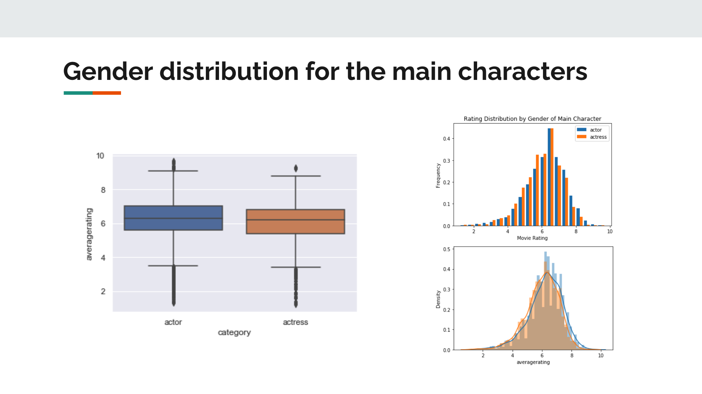
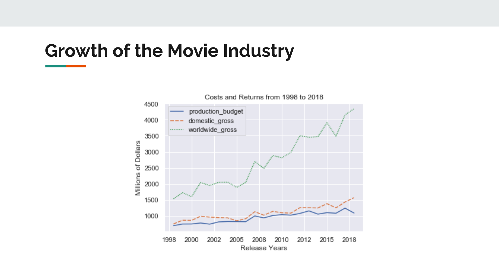
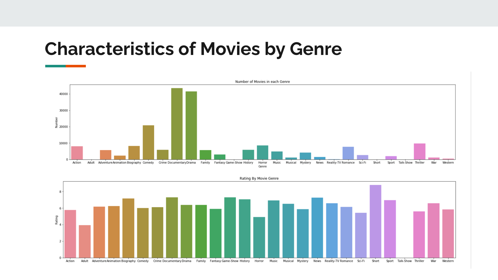
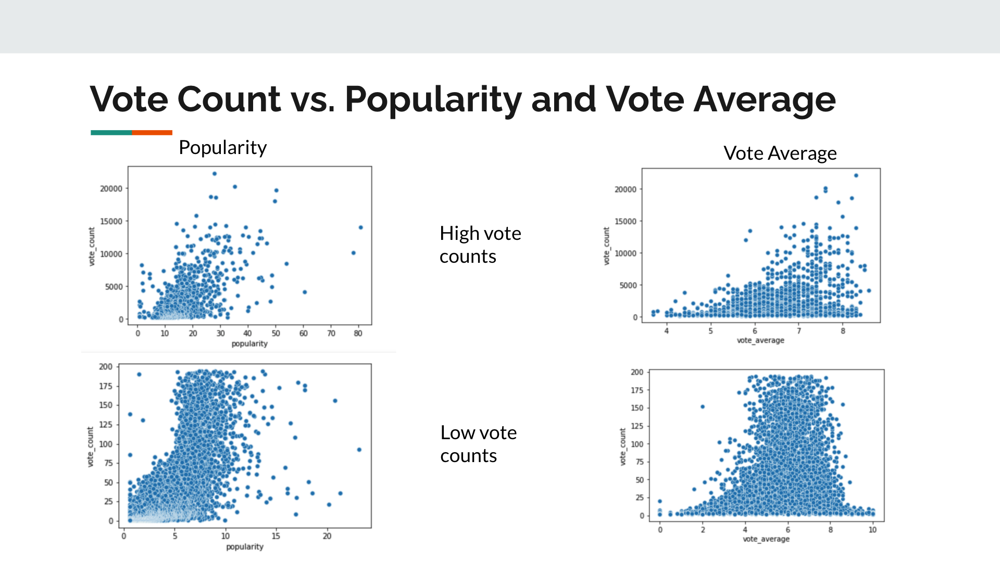

# microsoft-movie-analysis
# Microsoft Movie Analysis

## Members
Project members: TaeJoon Kim and Matthew Zhang

## Overview/Business Problem
Microsoft sees all the big companies creating original video content, and they want to get in on the fun. They have decided to create a new movie studio, but the problem is they don’t know anything about creating movies. They have hired you to help them better understand the movie industry. Our team was charged with exploring what type of films are currently doing the best at the box office. Moreover, to turn those findings into actionable insights that the head of Microsoft's new movie studio can use to help decide what type of films to create.

## Data
This analysis uses data from the provided zippedData folder. The folder contains data from IMDB, TMDB and the Box Office Mojo. 

## Insights

